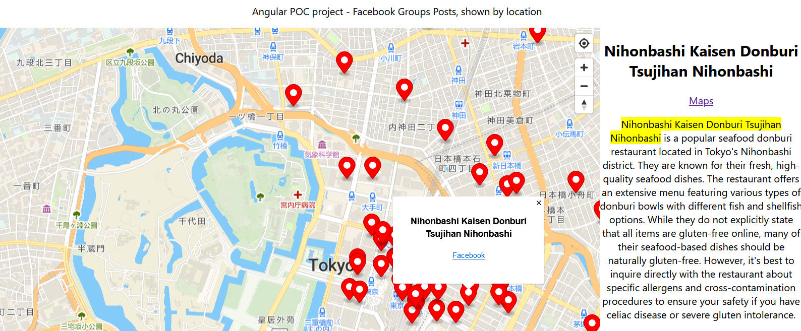
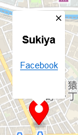
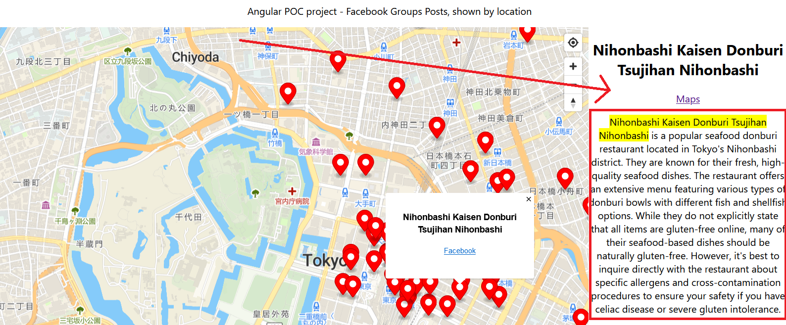

# Gluten - POC project

I'm a coeliac, finding gluten free restaurants overseas requires a great research effort, lets make that easier (and create a POC MAUI app)

There is a great deal of information about places to eat out in various places online, forums, blogs etc
This information is generally not formatted well for the main question people have when travelling: 
I am here <insert street or city name>, what places are near by can I eat? Do they have a gluten free menu? Do they understand what gluten free means?

So the problem to be solved with this project is, how can I collect, format, sort information from these sources and present it in a geo spatial way, 
i.e. on google maps

Automate as much as possible the above process, provide information to fellow coeliacs and people who wish to eat gluten free

## Top level design 

https://miro.com/app/board/uXjVLStmKTs=/?share_link_id=80895895213

## Smeagol

Collect information from Facebook groups.

## Frodo

Parse/process collected information to make it cleaner, quicker to read. Create geographical locations for each data item.
Use AI to help extract key data fields.
Create a database indexed on location, so it can be later used to search for relevant local information.

# User document V0

This application provides a map view with selectable pins.

when a pin is selected the name of the restaurant will be shown with links to facebook groups posts.

An AI generated summary is also shown, along with a google maps link (this is useful to navigate to or get more detailed information).

There is a button to move the map to your current location.

Note: Pins and summaries are AI generated, always verify the information by reading the linked group posts and the restaurant staff.

